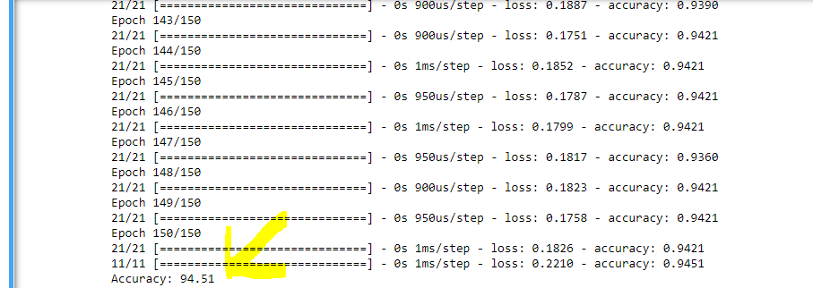
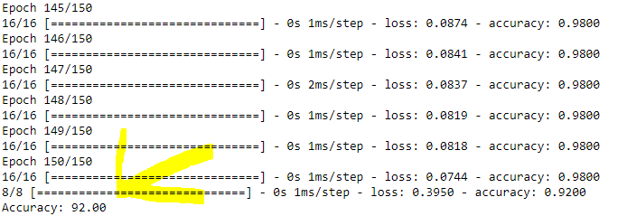
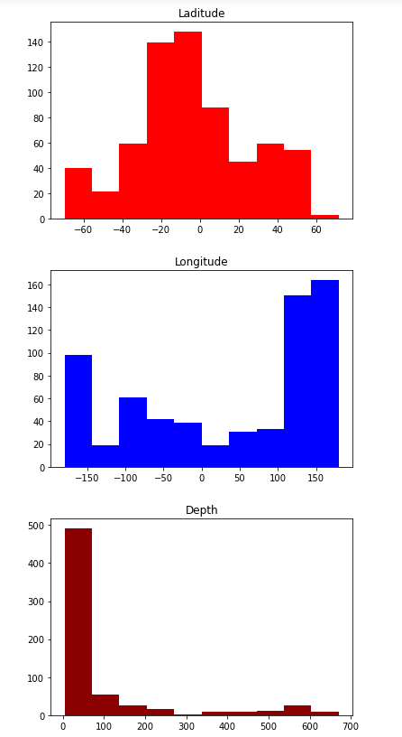
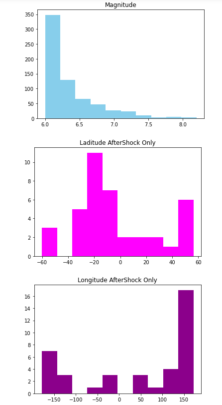
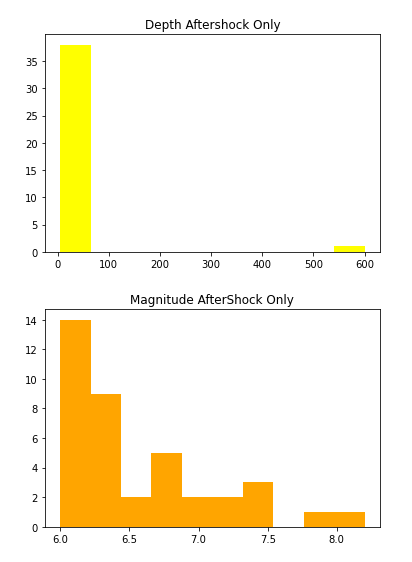

This project uses federal csv data and a public seismological data API in addition to tensor flow
to graph earthquake data, decypher aftershocks in the data, and to predict if an earthquake will
be followed by an aftershock within 24-48 hours. The results varied between 92 and 94 percent accuracy
based on the data sets that were used. The csv data (which was much simpler and more direct) was the more
accurate data set with the normalized waveform graph data (from the API) not being too far behind.

CSV Data Model

Waveform Data Model

